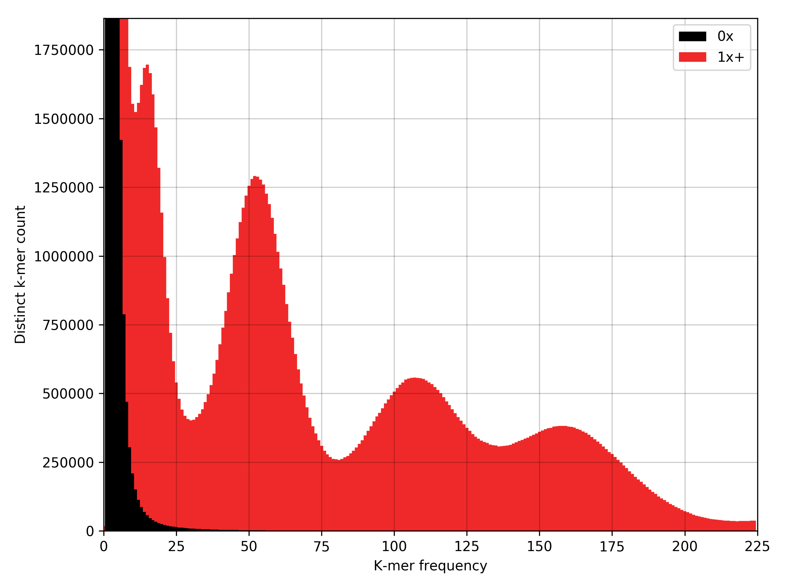
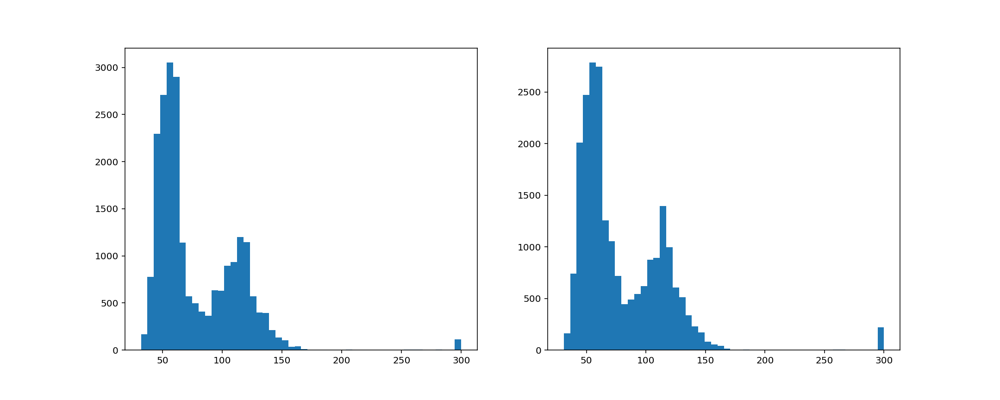
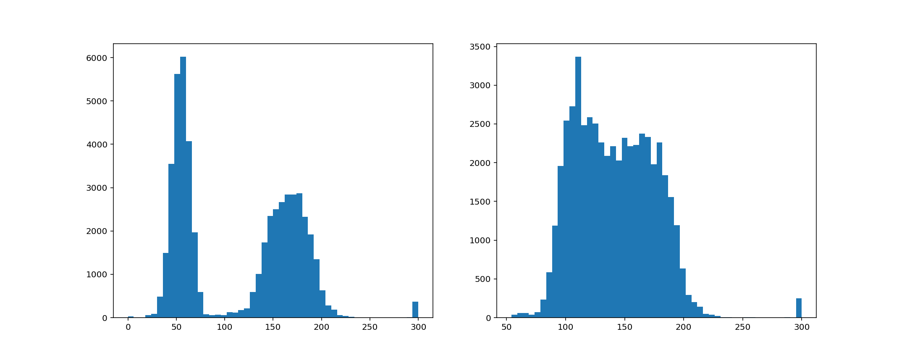
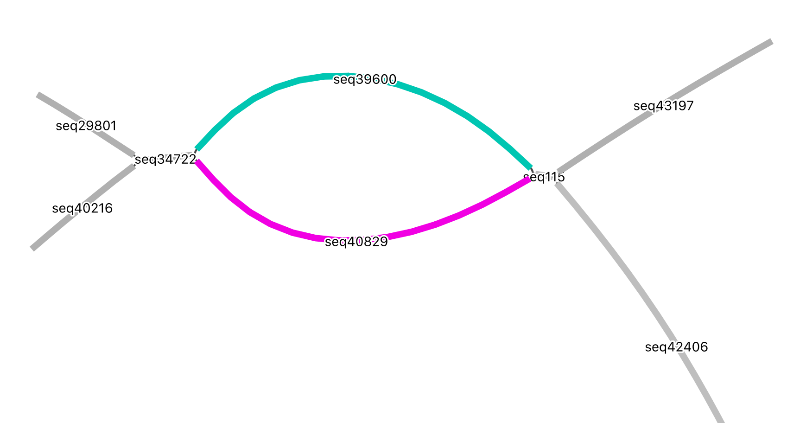
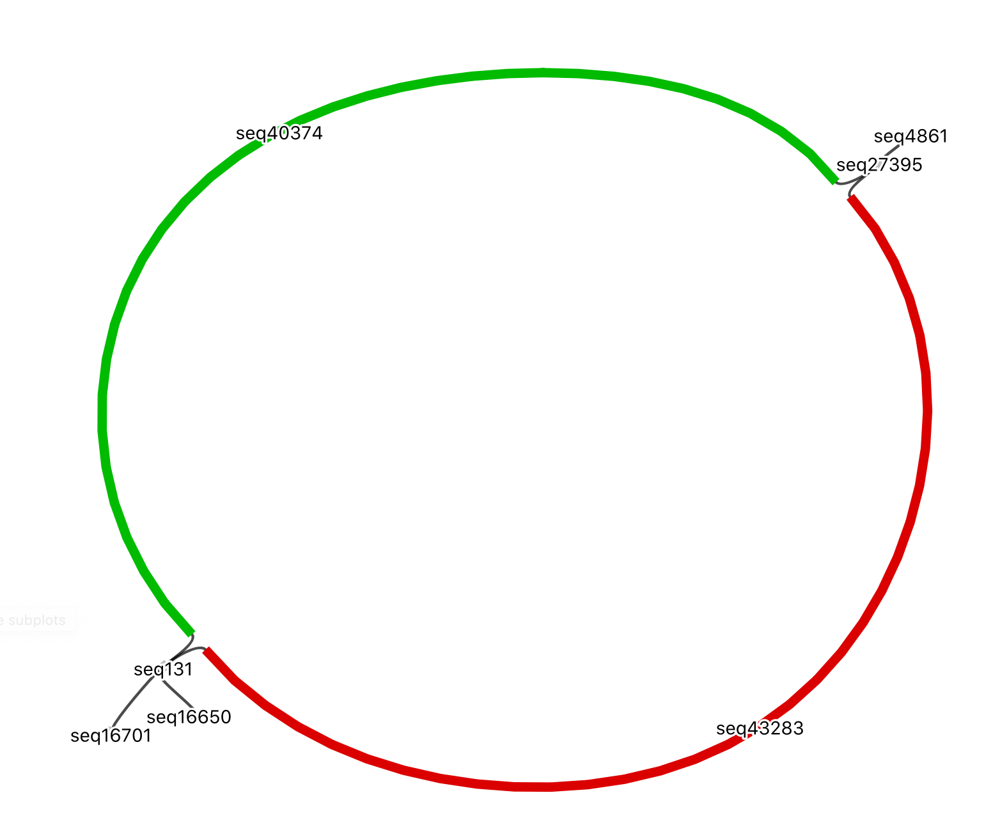
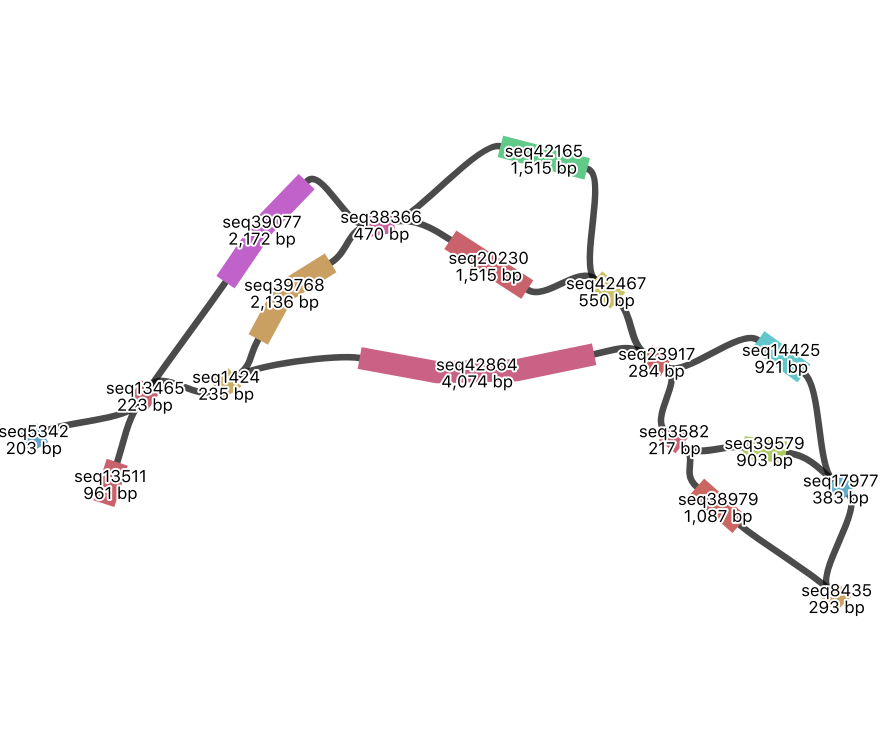
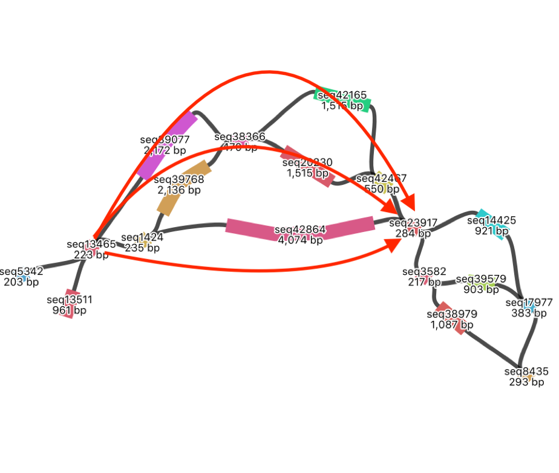
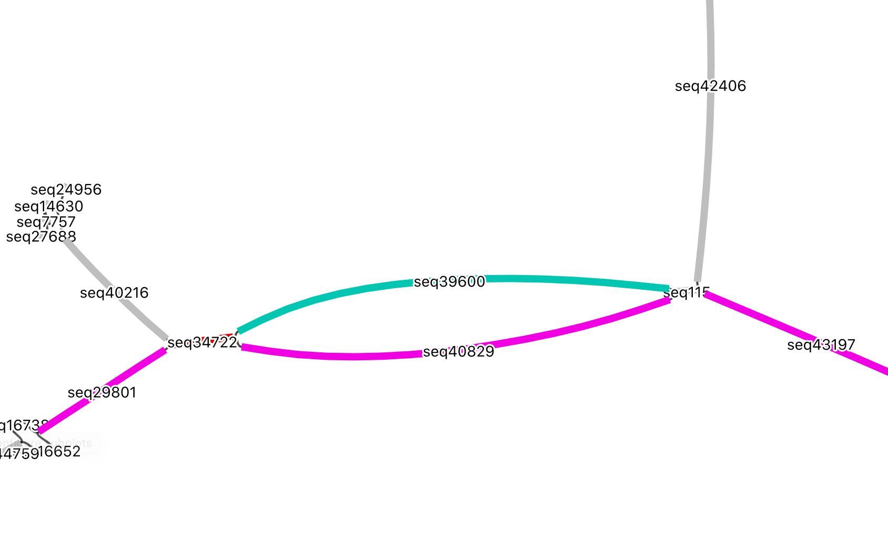
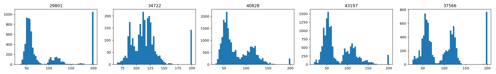

## Triploid genome analysis (F. cylindrus)

### Contig assembly and content analysis

We create a contigs_raw.gfa output using w2rap-contigger.

```shell
w2rap-contigger/bin/w2rap-contigger -t 16 -r "readfile_1.fastq, readfile_2.fastq" -o F.cylindrus_assembly -p F.cylindrus
```

This is split into a .gfa and accompanying .fasta using custom python scripts. Verification of read content in the assembly is performed by KAT k-mer spectra.

```shell
kat comp -o F.cylindrus_contigs_vs_reads -t8 -H 2000000000 -I 1000000000 "readfile_1.fastq readfile_2.fastq" F.cylindrus_contigs_raw.fasta
```

K-mer coverage is obtained from the mode of the fundamental frequency distribution of the spectra. Total genomic content is estimated from the spectra matrix file by total shared k-mers/k-mer coverage. 

Bacterial contamination is isolated by k-mer frequency in a KAT sect. This contamination can be identified by BLAST, filtered for 95% coverage and 95% identity. The main F. cylindrus distribution can also be confirmed by BLAST. 

```shell
kat sect -t8 -H 2000000000 F.cylindrus_contigs_raw.fasta readfile_1.fastq readfile_2.fastq

cat kat-sect-stats.tsv |awk '{if ($2 < 25 || $2 > 220) print;}' > bacterial_isolate.fasta
```


### Creating the WorkSpace

We first create a datastrore of the short reads, long reads and k-mer counter. 

```shell
sdg-datastore make -t paired -n illumina -o short-reads.datastore -1 readfile_1.fastq -2 readfile_2.fastq

sdg-datastore make -t long -n nanopore -o long-reads.datastore -L longread_file.fastq

sdg-kmercounts make -g F.cylindrus_contigs_raw.gfa -f readfile_1.fastq -f readfile_2.fastq -o k-mer-count -n kmer-count
```

We then use SDG to create a workspace from the W2rap-contigger .gfa, paired-end reads, long reads and k-mer count. 

```python
import sys
sys.path.append('path/to/sdg/build')
import pysdg as SDG
ws = SDG.WorkSpace()
ws.sdg.load_from_gfa("F.cylindrus_contigs_raw.gfa")
ws.add_paired_reads_datastore("short-reads.datastore.prseq", "PE1")
ws.add_long_reads_datastore("long-reads.datastore.loseq","LR1")
ws.add_kmer_counter("pe.count","kmer-count")
kcount = ws.get_kmer_counter("kmer-count")
```

And check the datastores and k-mer counter are available before saving the datastore to disk.

```
ws.list_paired_reads_datastores()
ws.list_long_reads_datastores()
ws.list_kmer_counters()
kcount.list_names()
ws.dump_to_disk('sr-lr-kc.sdgws')
```


### Analysing bubble content to check for ploidy signatures

We form a subset of the longest, contiguous bubbles and view how their k-mers are distirbuted. This gives an indication of the number of haplotypes in syntenic regions of the graph. 

```python
bubbles=[]
for nv in ws.sdg.get_all_nodeviews():
  if nv.size()>20000 and len(nv.parallels())==1 and nv.node_id() not in [abs(n.node_id()) for n in nv.parallels()]:
    bubble_nvs=(nv,nv.parallels()[0])
    if bubble_nvs[1].size()>20000:
        bubbles.append(bubble_nvs)
len(bubbles)
```

Output the number of bubbles in the selection:

```output
98
```

We can compare the k-mer spectra of each side of the bubbles to see which haplotypes are diverging.

```python
print (bubbles[0])

%matplotlib osx
sub1= bubbles[0][0]
sub2= bubbles[0][1]
fig = plt.figure(figsize=(15,6))
fig.add_subplot(1,2,1)
plt.hist([x if x < 300 else 300 for x in sub1.kmer_coverage("kmercount1", "pe")], bins=50);
fig.add_subplot(1,2,2)
plt.hist([x if x < 300 else 300 for x in sub2.kmer_coverage("kmercount1", "pe")], bins=50);
plt.show(block=True)
```

Output:

```
(<NodeView: Node 39600 in SDG>, <NodeView: Node 40829 in SDG>)
```



This shows both contigs of the bubble consist of k-mers either uniquely, or twice. These are divergent haplotypes.

```
(<NodeView: Node 40374 in SDG>, <NodeView: Node 43283 in SDG>)
```



This shows one of the contigs contains kmers that occur uniquely or three times, and the other contains k-mers that occur twice or three times. In other words, the second contig represents two collapsed haplotypes. 

To print all bubbles defined in the previous "bubbles" variable:

```python
%matplotlib osx

fig = plt.figure(figsize=(15,50))
count = 1
for bubble in bubbles:
    sub1 = bubble[0]
    sub2 = bubble[1]
    fig.add_subplot(len(bubbles),2,count)
    plt.hist([x if x < 300 else 300 for x in sub1.kmer_coverage("kmercount1", "pe")], bins=50)
    fig.add_subplot(len(bubbles),2,count+1)
    plt.hist([x if x < 300 else 300 for x in sub2.kmer_coverage("kmercount1", "pe")], bins=50)
    count+=2
plt.savefig("all_bubbles.png")
```

Graph structure can be viewed using BANDAGE. The following two graphs show  the DBG of the aforementioned bubbles. Blue/pink is where two haplotypes diverge, and red is the two collapsed haplotypes. 



Divergence between three haplotypes becomes fragmented as contiguity drops. In this complex knot of contigs, we can trace three potential paths through this fragmented region. This represents three haplotypes that we need to untangle. 



### Long read mapping

Long read mapping is used to resolve haplotypes through complex regions, increasing sequence contiguity. We map the long reads to the .gfa in the SDG workspace and save the new workspace to disk.

```python
lords = ws.get_long_reads_datastore('LR1')
lords.mapper.k=15
lords.mapper.map_reads()
ws.dump_to_disk('sr-lr-kc-mapped.sdgws')
```

We then use the linkage maker to make a selection of the contigs above 1000bp. These should have enough overlap with the long reads to make reliable linkages. 

```Python
lm=SDG.LinkageMaker(ws.sdg)
lm.select_by_size(1000)
lm.report_selection()
```

```shell
Current selection: 11006 / 45411 nodes  with  132338414 / 145235654 bp
```

We run the multi-linkage using an overlap of 800bp and an identity to the long reads of 10%. The number of mapping can then be checked.

```python
lr_mldg=lm.make_longreads_multilinkage(ws.long_reads_datastores[0].mapper,800,10)
lords.mapper.print_status()
```

```shell
Long read mappings: 7199681 mappings.
```

We can use the long reads datastore to check the linkage between haplotypes. This allows us to manually identify haplotype contiguity.

```python
node40829=lr_mldg.get_nodeview(40829)
for n in node40829.next(): print("NEXT: ",n)
for p in node40829.prev(): print("PREV: ",p)
```

```shell
NEXT:  LinkView: 410bp to Node -43197
NEXT:  LinkView: 414bp to Node -43197
NEXT:  LinkView: 417bp to Node -43197
NEXT:  LinkView: 432bp to Node -43197
NEXT:  LinkView: 432bp to Node -43197
NEXT:  LinkView: 434bp to Node -43197
NEXT:  LinkView: 435bp to Node -43197
NEXT:  LinkView: 437bp to Node -43197
NEXT:  LinkView: 437bp to Node -43197
NEXT:  LinkView: 439bp to Node -43197
...
NEXT:  LinkView: 26045bp to Node -37566
NEXT:  LinkView: 26124bp to Node -37566
NEXT:  LinkView: 26185bp to Node -37566
NEXT:  LinkView: 26210bp to Node -37566
NEXT:  LinkView: 26256bp to Node -37566
NEXT:  LinkView: 32383bp to Node 40904
NEXT:  LinkView: 35051bp to Node -38500
NEXT:  LinkView: 35136bp to Node -38500
NEXT:  LinkView: 36927bp to Node -40431
NEXT:  LinkView: 39334bp to Node -41498
NEXT:  LinkView: 41838bp to Node 22758

PREV:  LinkView: -207bp to Node 34722
PREV:  LinkView: -206bp to Node 34722
PREV:  LinkView: -202bp to Node 34722
PREV:  LinkView: -201bp to Node 34722
PREV:  LinkView: -201bp to Node 34722
PREV:  LinkView: -201bp to Node 34722
PREV:  LinkView: -201bp to Node 34722
PREV:  LinkView: -201bp to Node 34722
PREV:  LinkView: -200bp to Node 34722
...
PREV:  LinkView: 1975bp to Node -29801
PREV:  LinkView: 2325bp to Node -29801
PREV:  LinkView: 2372bp to Node -29801
PREV:  LinkView: 2393bp to Node -29801
PREV:  LinkView: 2400bp to Node -29801
PREV:  LinkView: 2413bp to Node -29801
PREV:  LinkView: 2421bp to Node -29801
PREV:  LinkView: 2426bp to Node -29801
PREV:  LinkView: 2429bp to Node -29801
...
PREV:  LinkView: 6629bp to Node 42768
PREV:  LinkView: 6925bp to Node 42887
PREV:  LinkView: 9466bp to Node -44759
PREV:  LinkView: 9676bp to Node -44759
PREV:  LinkView: 9782bp to Node -44759
PREV:  LinkView: 9803bp to Node -44759
PREV:  LinkView: 9822bp to Node -44759
PREV:  LinkView: 9846bp to Node -44759
...
PREV:  LinkView: 16811bp to Node -37104
PREV:  LinkView: 19105bp to Node 36077
PREV:  LinkView: 25636bp to Node -31416
```

Here, node 40829 links to nodes 43197 and 37566 in the next direction, and 34722 and 29801 in the previous direction. We confirm the k-mer distributions of those contigs and can view the haplotype in the .gfa (pink). 





Contig 34722 is collapsed and consists of k-mers appearing two or three times. This is shared with the syntenic 39600 haplotype. The other contigs show contiguity for the rest of the diverged haplotype. 